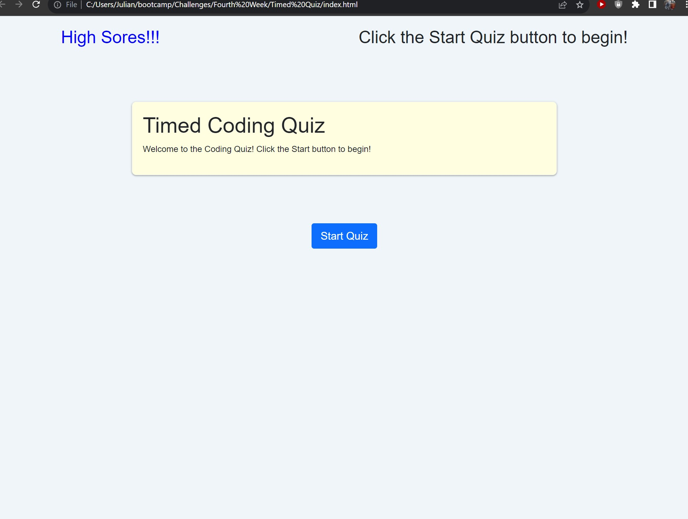

# Times_Coding_Quiz

## Description

Timed quiz website for the taking of a quiz!

## Table of Contents

- [Introduction](#introduction)
- [Features](#features)
- [Usage](#usage)
- [License](#license)

## Introduction

This was much harder then previous challenges. Plus I had to re-do my git folder after a clash between my home and work computers. Learnt a lot though.

## Features

A timed test and the chance to save your score and compare it with others

## Usage

Screenshot:

```md
    
```

Link to website example:
    
```md
    [Link to website](https://julian-a-mort.github.io/Times_Coding_Quiz/)
```


## License

None! Go nuts!

